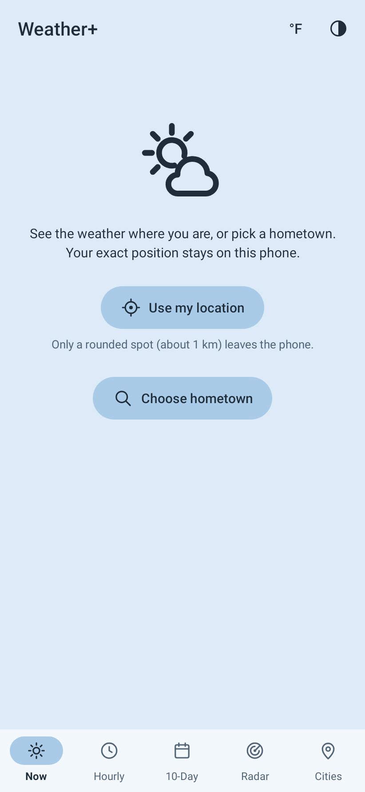
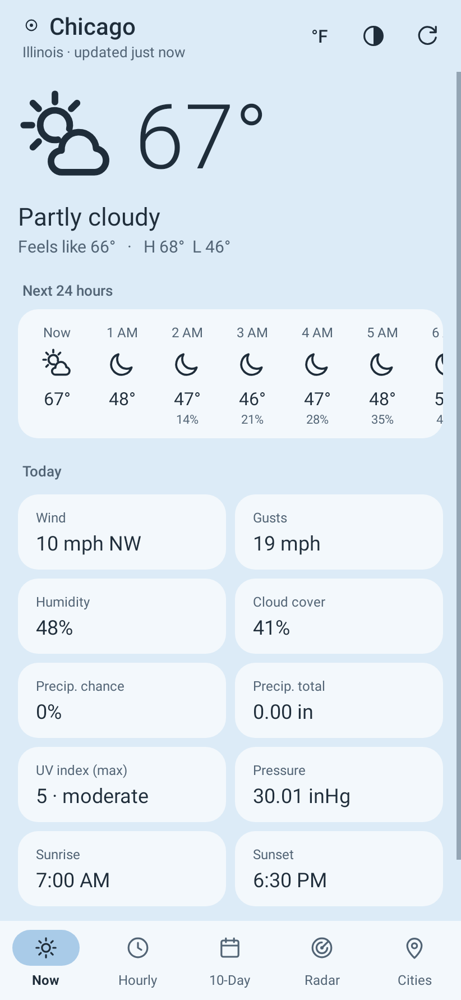
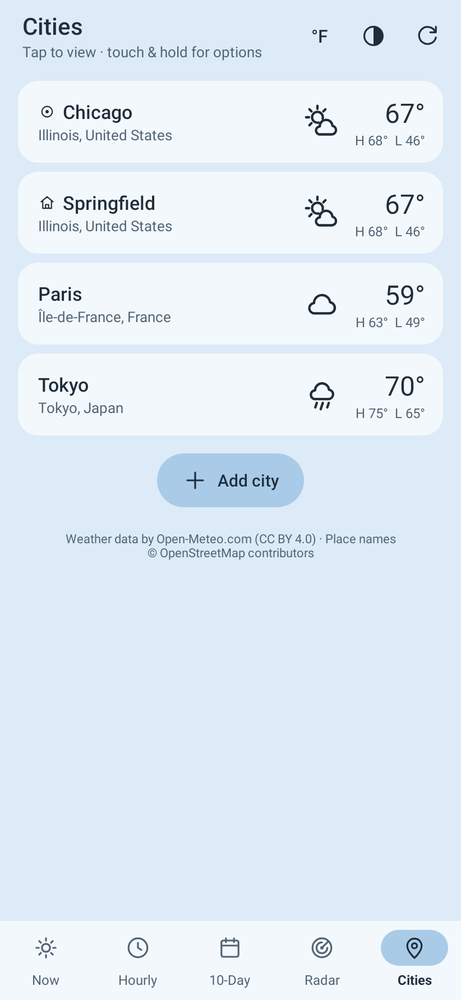
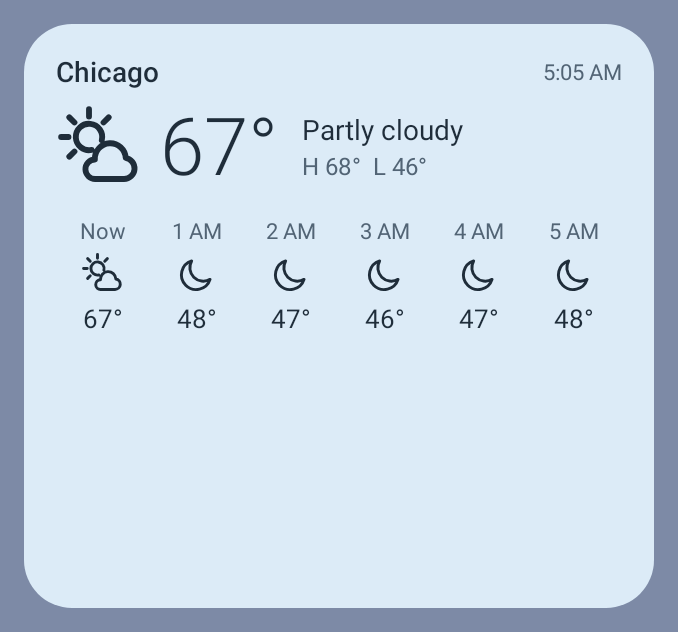

# Weather

A small, fast Android weather app: current conditions for your hometown, hourly and 10-day forecasts,
an animated precipitation radar, and a list of saved cities. Pastel themes, line icons, no clutter.
It comes as two apps built from the same code: **Weather**, described first, and
[**Weather+**](#weather-my-location), which can also show the weather where you are.

- **No API key, no account.** Forecasts come from [Open-Meteo](https://open-meteo.com) (free, CC BY 4.0);
  radar from [RainViewer](https://www.rainviewer.com/api.html) (free for personal use) over
  [OpenStreetMap](https://www.openstreetmap.org/copyright) map tiles.
- **No location permission** in Weather. You pick your hometown by name or postal code; it's remembered on
  the device. (Weather+ asks for location only when you tap "Use my location"; see [below](#weather-my-location).)
- **One permission:** Internet. Forecasts and city searches go to `open-meteo.com`. Only when you open the
  Radar tab, the app also fetches radar frames from `rainviewer.com` and map tiles from
  `tile.openstreetmap.org` (those reveal roughly which area you're looking at). Nothing else.
- **Tiny and quick:** plain Android framework views, no libraries, no Google Play Services. Forecasts are
  cached, so the app opens instantly (and works offline with the last data) and refreshes when the data is
  older than 15 minutes.
- Android 11 or newer (built for Android 16/17, edge-to-edge, predictive back).

<p>
  
  
  
  
  
</p>

<sub>Forecast screenshots use sample data (the radar is live). They're rendered by the UI test; run the Build workflow with
"Commit fresh screenshots" ticked to refresh them.</sub>

## Using it

| Tab | What it shows |
| --- | --- |
| **Now** | Hometown conditions, next 24 hours, wind/humidity/UV/pressure/sunrise/sunset |
| **Hourly** | Next 48 hours, grouped by day |
| **10-Day** | Daily highs/lows on a shared scale; tap a day for details |
| **Radar** | Rain & snow over the past ~2 hours, animated. Drag, pinch or double-tap to zoom; ◎ recentres |
| **Cities** | Hometown + saved cities. Tap to view one; touch & hold to make it your hometown, reorder or remove |

Plus a resizable **home-screen widget** (below).

Header buttons: **°F/°C** switches units instantly, **◐** picks a theme (Sky, Mint, Peach, Lavender, Rose,
Lemon, Dusk, Moss, or Auto = Sky/Dusk following the system dark mode), **↻** refreshes.

Search tip: add a state or country to narrow results, e.g. `Portland, OR` or `Paris, FR`.

### Home-screen widget

Touch & hold the home screen → **Widgets** → **Weather**. It opens at 4×2 and resizes from 2×1 up to 4×3 and
beyond: the current conditions always, the next hours when it's wide, the next days when it's tall.

- Shows your hometown. To show a saved city instead, touch & hold the widget and pick **Reconfigure** (on
  Android 11 you choose when placing it). Tapping it opens the app on that city. Removing the city from the
  app puts the widget back on your hometown.
- Refreshes about every 30 minutes (the shortest interval Android allows for widgets; it pauses while the phone
  is in deep sleep) and straight away whenever the app fetches new data. No extra permissions.
- Uses the app's theme; with **Auto** it follows the system's light/dark mode.

<p>
  
  
  
  
</p>

## Weather+ (My location)

**Weather+** is the same app plus **My location**: the weather where you are, next to your hometown and saved
cities. It's a separate app (`io.github.ramziag.weather.location`) that installs alongside Weather and keeps its
own settings.

- Tap **Use my location** on the first screen or in **Cities**, and allow precise or approximate location.
  Now, Hourly, 10-Day and Radar then show My location, named after the town you're in, and it's updated
  while the app is open. While it locates, or when it can't, the header says so ("Locating…", "Location is off").
- **Cities** lists My location first. Touch & hold it to make it your hometown, save it as a city, switch to
  precise location, turn off place-name lookups, or stop using location.
- **Radar** marks your position with a dot, and a shaded circle when it's only known roughly; ◎ centres the map
  on it.
- The **widget** (Widgets → **Weather+**) can show My location: pick it under **Reconfigure**.
- Choosing a hometown or adding a city offers **Use my location** too. It picks the town you're in, without
  turning My location on.
- Indoors GPS may not find you. Android's network location (Settings › Location › Location services) helps.

<p>
  
  
  
  
</p>

### Privacy

**Weather** never accesses your location. It has no location permission and no location code, and CI checks
both.

**Weather+** uses your location only after you tap "Use my location", and only while the app is open on screen.
It never uses it in the background, and the widget never locates: it shows the last place the app found.

- Your exact position is kept in memory only, for the radar's dot. It is never stored or sent anywhere.
- The phone stores, excluded from backups: the position rounded to 0.01° (about 1 km) with its name and
  forecast, when it last located, whether that was precise, and up to 20 place names with their rounded
  positions, so each spot is looked up once.
- **open-meteo.com** receives the rounded position to fetch its forecast, just as it does for a saved city
  (the widget's background refresh included).
- **nominatim.openstreetmap.org** (OpenStreetMap Foundation) receives the rounded position and your language to
  look up the place name. This happens only for a ~1 km area that isn't within 3 km of a saved place and hasn't
  been looked up recently. You can switch it off with "Don't look up place names". Both services also see your IP
  address.
- Radar tiles come from `rainviewer.com` and `tile.openstreetmap.org`, as in Weather. ◎ centres the map on your
  position; even at the closest zoom a tile covers several kilometres.
- Precise and approximate location are rounded the same way before anything leaves the phone. Approximate is
  already blurred by Android (to about 2 km), so its rounded spot may be a neighbouring one.
- "Stop using location" (touch & hold My location in Cities) erases all of this, and on Android 13+ also gives
  the permission back once you leave the app. A hometown or city you saved from My location stays.

## Getting the APK

Every push builds signed release APKs of both apps in GitHub Actions.

1. Open the repo's **Actions** tab → **Build** → **Run workflow** (leave "Publish … release" ticked).
2. When it finishes, the APKs are on the **Releases** page: `weather-1.0.N.apk` is Weather and
   `weather-location-1.0.N.apk` is Weather+. Open the one you want on the phone, download, and install (allow
   "Install unknown apps" for your browser when asked).

Each run also attaches the APKs as workflow artifacts. To get updates automatically, point
[Obtainium](https://github.com/ImranR98/Obtainium) at this repository's releases and set its APK filter regex to
`^weather-1\.` for Weather or `^weather-location-` for Weather+ (add the repository twice for both).

### Signing

Builds are signed with `keystore/shared.keystore`, which is committed on purpose so every build (yours or
CI's) can update the previous one in place. It's a public key: fine for a personal sideloaded app, but if
you'd rather use a private key, create one and add these repository secrets; CI uses it automatically:

```sh
keytool -genkeypair -keystore release.jks -alias weather -keyalg RSA -keysize 4096 -validity 10000
base64 -w0 release.jks   # → SIGNING_KEYSTORE_BASE64
```

`SIGNING_STORE_PASSWORD`, `SIGNING_KEY_ALIAS` (`weather`), `SIGNING_KEY_PASSWORD`. Switching keys means
uninstalling the old build once.

## Building locally

Needs JDK 17+ and the Android SDK (Android Studio, or `ANDROID_HOME` set).

```sh
./gradlew assembleStandardRelease        # Weather: app/build/outputs/apk/standard/release/app-standard-release.apk
./gradlew assembleLocationRelease        # Weather+: app/build/outputs/apk/location/release/app-location-release.apk
./gradlew test                           # unit + UI tests of both apps; screenshots land in app/build/screenshots
LIVE_API=1 ./gradlew test                # also checks the live Open-Meteo API
adb install -r app/build/outputs/apk/standard/release/app-standard-release.apk
```

Shared code reaches Weather+'s location code only through `Here`, which each app defines separately;
`./gradlew test` compiles both, so run it after changing either one.

## Code map

Shared code is in `app/src/main/java/io/github/ramziag/weather/`:

- `MainActivity.kt` — the single screen: header, tabs, pages, search.
- `OpenMeteo.kt` — forecast and search URLs and JSON parsing (pure JVM, unit tested).
- `Radar.kt`, `RadarView.kt`, `TileCache.kt` — radar frames and tile URLs, the map view (pan/zoom/animation),
  and the tile memory cache (backed by Android's HTTP disk cache).
- `Repo.kt`, `ForecastFiles.kt` — memory + disk cache and background loading; the disk cache is shared with
  the widget.
- `Widgets.kt`, `WeatherWidget.kt`, `WidgetRefreshJob.kt`, `WidgetConfigActivity.kt` — the home-screen widget:
  drawing (RemoteViews), the system update hook, the background fetch job and the city picker.
- `Store.kt` — saved hometown, cities, units and theme; theme list.
- `Forecast.kt`, `Place.kt`, `Fmt.kt`, `Wmo.kt`, `RangeBar.kt`, `Http.kt` — models, formatting, weather
  codes, the 10-day temperature bar, HTTP helper.
- `HereHost.kt` — what Weather+'s My location (`Here`) needs from the screen, its buttons and constants. Shared code
  uses `Here` only inside `if (Here.ENABLED)`.

Each app has its own `Here`, with the same functions:

- `app/src/standard/` — Weather: `Here.kt` does nothing (`ENABLED = false`); no location permission or code.
- `app/src/location/` — Weather+: the location permissions (`AndroidManifest.xml`), its name, wording and icons
  (`res/`), and in `java/…`:
  - `Here.kt` — My location: the permission flow, when to locate, the rounded place and its name, its saved state
    (`here.json`), buttons and menu.
  - `Locator.kt` — one location attempt with Android's `LocationManager`, and the pure `Geo` rules (rounding,
    distance, which fix to use).
  - `Nominatim.kt` — place names from OpenStreetMap's Nominatim (URL and parsing, pure JVM, unit tested) and their
    cache (`names.json`) with its request limits.

Tests in `app/src/test` run for both apps; `src/testStandard` checks that Weather has no location permission, and
`src/testLocation` holds Weather+'s.
