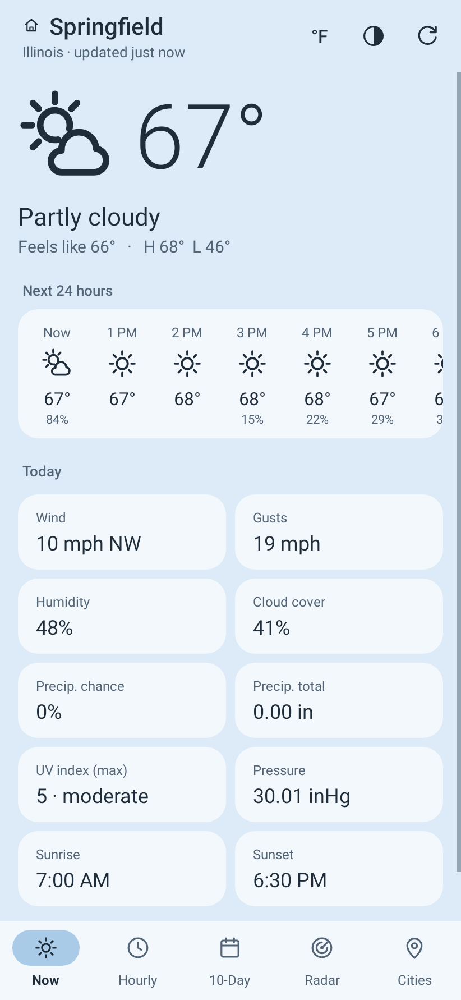
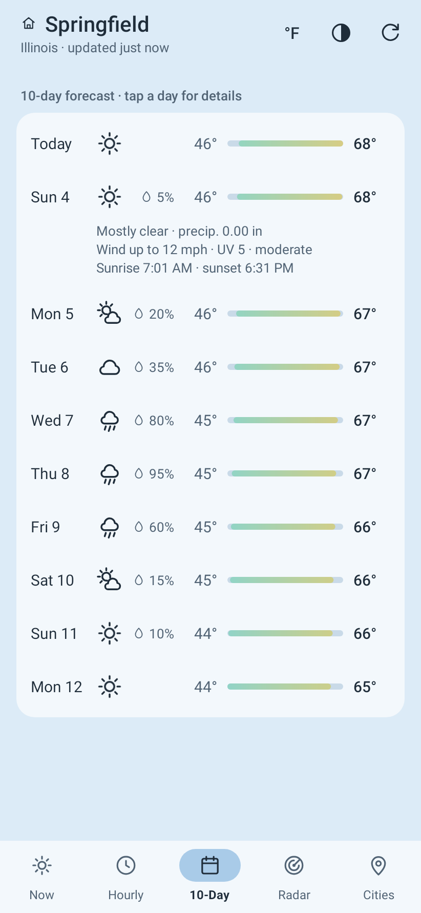
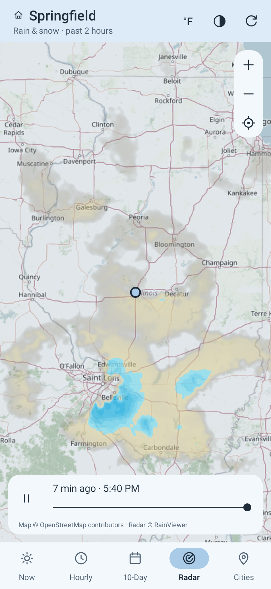
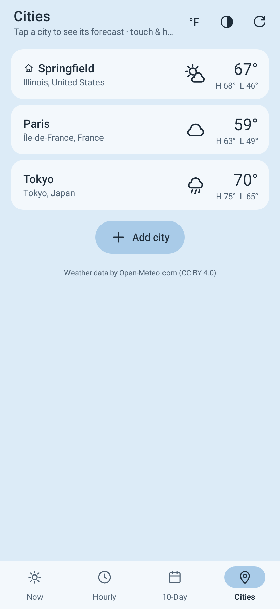
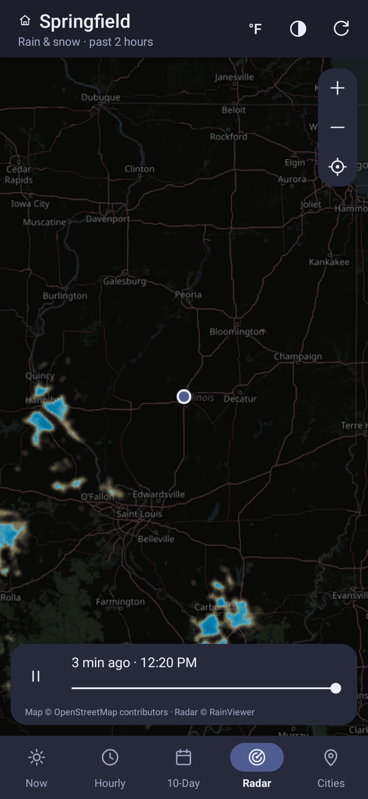
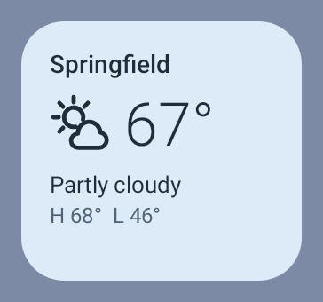
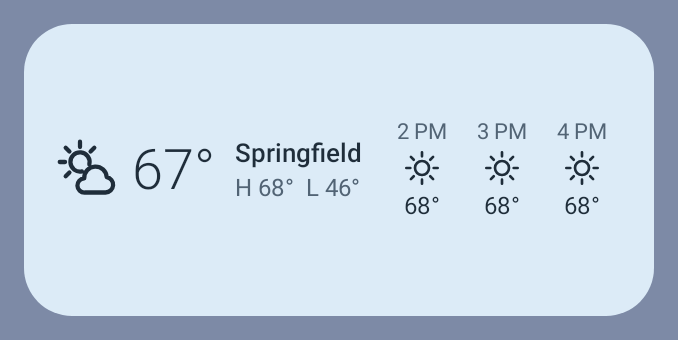
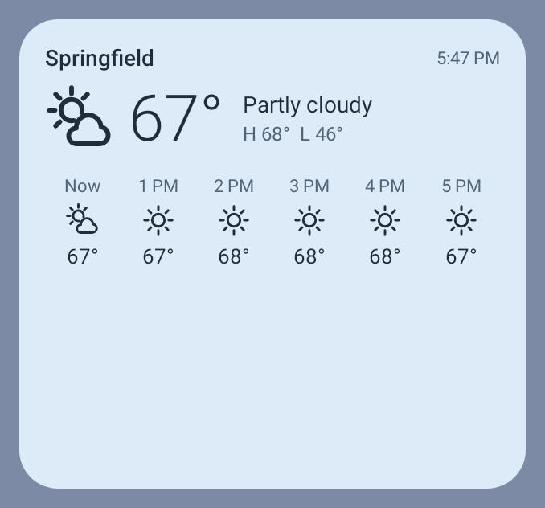
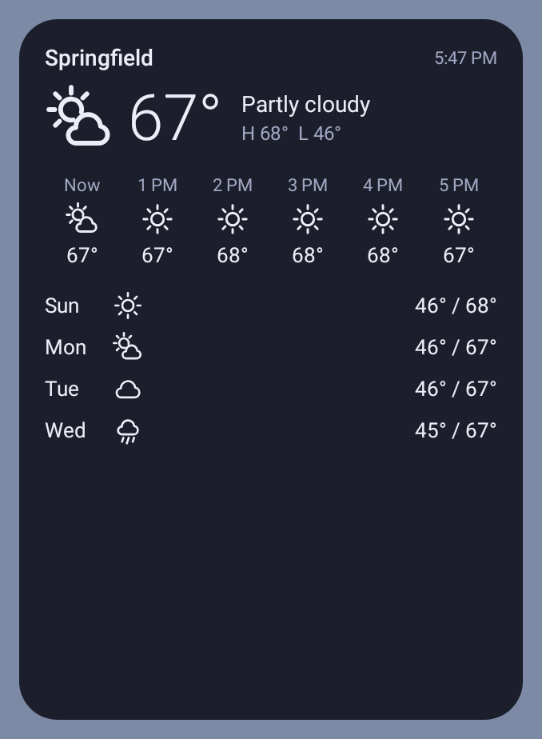

# Weather

A small, fast Android weather app: current conditions for your hometown, hourly and 10-day forecasts,
an animated precipitation radar, and a list of saved cities. Pastel themes, line icons, no clutter.

- **No API key, no account.** Forecasts come from [Open-Meteo](https://open-meteo.com) (free, CC BY 4.0);
  radar from [RainViewer](https://www.rainviewer.com/api.html) (free for personal use) over
  [OpenStreetMap](https://www.openstreetmap.org/copyright) map tiles.
- **No location permission.** You pick your hometown by name or postal code; it's remembered on the device.
- **One permission:** Internet. Forecasts and city searches go to `open-meteo.com`. Only when you open the
  Radar tab, the app also fetches radar frames from `rainviewer.com` and map tiles from
  `tile.openstreetmap.org` (those reveal roughly which area you're looking at). Nothing else.
- **Tiny and quick:** plain Android framework views, no libraries, no Google Play Services. Forecasts are
  cached, so the app opens instantly (and works offline with the last data) and refreshes when the data is
  older than 15 minutes.
- Android 11 or newer (built for Android 16/17, edge-to-edge, predictive back).

<p>
  
  
  
  
  
</p>

<sub>Forecast screenshots use sample data (the radar is live). They're rendered by the UI test; run the Build workflow with
"Commit fresh screenshots" ticked to refresh them.</sub>

## Using it

| Tab | What it shows |
| --- | --- |
| **Now** | Hometown conditions, next 24 hours, wind/humidity/UV/pressure/sunrise/sunset |
| **Hourly** | Next 48 hours, grouped by day |
| **10-Day** | Daily highs/lows on a shared scale; tap a day for details |
| **Radar** | Rain & snow over the past ~2 hours, animated. Drag, pinch or double-tap to zoom; ◎ recentres |
| **Cities** | Hometown + saved cities. Tap to view one; touch & hold to make it your hometown, reorder or remove |

Plus a resizable **home-screen widget** (below).

Header buttons: **°F/°C** switches units instantly, **◐** picks a theme (Sky, Mint, Peach, Lavender, Rose,
Lemon, Dusk, Moss, or Auto = Sky/Dusk following the system dark mode), **↻** refreshes.

Search tip: add a state or country to narrow results, e.g. `Portland, OR` or `Paris, FR`.

### Home-screen widget

Touch & hold the home screen → **Widgets** → **Weather**. It opens at 4×2 and resizes from 2×1 up to 4×3 and
beyond: the current conditions always, the next hours when it's wide, the next days when it's tall.

- Shows your hometown. To show a saved city instead, touch & hold the widget and pick **Reconfigure** (on
  Android 11 you choose when placing it). Tapping it opens the app on that city. Removing the city from the
  app puts the widget back on your hometown.
- Refreshes about every 30 minutes (the shortest interval Android allows for widgets; it pauses while the phone
  is in deep sleep) and straight away whenever the app fetches new data. No extra permissions.
- Uses the app's theme; with **Auto** it follows the system's light/dark mode.

<p>
  
  
  
  
</p>

## Getting the APK

Every push builds a signed release APK in GitHub Actions.

1. Open the repo's **Actions** tab → **Build** → **Run workflow** (leave "Publish … release" ticked).
2. When it finishes, the APK is on the **Releases** page. Open it on the phone, download, and install
   (allow "Install unknown apps" for your browser when asked).

Each run also attaches the APK as a workflow artifact. To get updates automatically, point
[Obtainium](https://github.com/ImranR98/Obtainium) at this repository's releases.

### Signing

Builds are signed with `keystore/shared.keystore`, which is committed on purpose so every build (yours or
CI's) can update the previous one in place. It's a public key: fine for a personal sideloaded app, but if
you'd rather use a private key, create one and add these repository secrets; CI uses it automatically:

```sh
keytool -genkeypair -keystore release.jks -alias weather -keyalg RSA -keysize 4096 -validity 10000
base64 -w0 release.jks   # → SIGNING_KEYSTORE_BASE64
```

`SIGNING_STORE_PASSWORD`, `SIGNING_KEY_ALIAS` (`weather`), `SIGNING_KEY_PASSWORD`. Switching keys means
uninstalling the old build once.

## Building locally

Needs JDK 17+ and the Android SDK (Android Studio, or `ANDROID_HOME` set).

```sh
./gradlew assembleRelease                # app/build/outputs/apk/release/app-release.apk
./gradlew testDebugUnitTest              # unit + UI tests; screenshots land in app/build/screenshots
LIVE_API=1 ./gradlew testDebugUnitTest   # also checks the live Open-Meteo API
adb install -r app/build/outputs/apk/release/app-release.apk
```

## Code map

All code is in `app/src/main/java/io/github/ramziag/weather/`:

- `MainActivity.kt` — the single screen: header, tabs, pages, search.
- `OpenMeteo.kt` — forecast and search URLs and JSON parsing (pure JVM, unit tested).
- `Radar.kt`, `RadarView.kt`, `TileCache.kt` — radar frames and tile URLs, the map view (pan/zoom/animation),
  and the tile memory cache (backed by Android's HTTP disk cache).
- `Repo.kt`, `ForecastFiles.kt` — memory + disk cache and background loading; the disk cache is shared with
  the widget.
- `Widgets.kt`, `WeatherWidget.kt`, `WidgetRefreshJob.kt`, `WidgetConfigActivity.kt` — the home-screen widget:
  drawing (RemoteViews), the system update hook, the background fetch job and the city picker.
- `Store.kt` — saved hometown, cities, units and theme; theme list.
- `Forecast.kt`, `Place.kt`, `Fmt.kt`, `Wmo.kt`, `RangeBar.kt`, `Http.kt` — models, formatting, weather
  codes, the 10-day temperature bar, HTTP helper.
